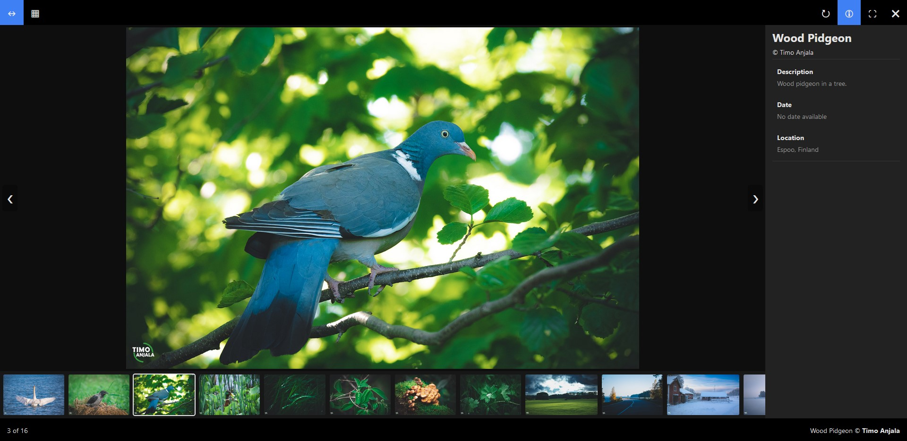

# React imageBrowser


> More preview images in preview-images folder.

# What is React imageBrowser?

React imageBrowser is a simple to use image browser component for React applications. It is designed to be easy to set up and use, while still being customizable and responsive. It can be used to display images in a grid or as a slideshow, with swipe-motion and automated slideshow features.

- Easy to set up
- Responsive
- Customizible
- Slide & Grid view
- Swipe-motion ready
- Automated slideshow

# Installation

```
npm install react-image-browser
```

> Install react-image-browser package from NPM.

### Manual installation

Clone the repository from GitHub and copy react-image-browser.jsx and imageBrowser.css to your project.

# Basic Setup

### Import

```JSX
import ImageBrowser from 'react-image-browser'
```

### Add images (object array)

```JSX
const images = [ 
    { url: 'imageURL', title: 'imageTitle', description: 'ImageALT', author: 'imageAuthor' }, 
    { url: 'imageURL', title: 'imageTitle', description: 'ImageALT', author: 'imageAuthor' } 
];
```
> Set up an array of objects, each containing image url, title, description, author, date, and location. Only url is mandatory, other info is optional. Images can be local or fetched from internet.

#### object options:
- url
- title (optional)
- description (optional)
- date (optional)
- location (otional)
- author (optional)

### Component

```JSX
<ImageBrowser images='images' />
```
> Add componennt to your application where you want images to show.

# Props

### images
```JSX
<ImageBrowser images='yourImgArray' />
```
> Array of image objects. Each object must contain url -property. Optional properties are title, description, author, date, location.

### open
```JSX
<ImageBrowser images='yourImgArray' open='grid' />
```
> Set to grid to open ImageBrowser in grid view. Default is slide.

### button
```JSX
<ImageBrowser images='yourImgArray' button='Open ImageBrowser' />
```
> Set a string / node to open ImageBrowser with button. Button style can be modified from inside imageBrowser.css file.

### actions
```JSX
<ImageBrowser images='yourImgArray' actions={true} />
```
> Set to true to display Like, Share, and Comment button on image info. Default is false. You need to create and pass your own functions to these buttons.

---
Read more about ImageBrowser from the website.
